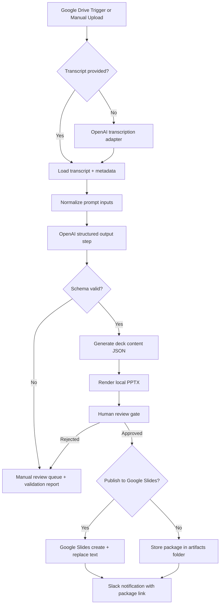

# Solution Architecture

## Goal
Convert a meeting recording or transcript into an auditable summary package:
- executive summary
- 3 objectives
- 3 actionable items
- next steps
- editable deck

The committed proof of concept is transcript-first. The production architecture adds audio/video transcription and Google Slides publishing without changing the normalized data contract.

## Recommended Production Stack
- **Orchestrator:** n8n
- **Primary model layer:** OpenAI
- **Storage / intake:** Google Drive shared folder
- **Final presentation target:** Google Slides
- **Proof-of-concept deck target:** local `.pptx`
- **Notification layer:** Slack

## Why This Shape
- It is operationally simple enough for a non-engineering team to own.
- The same normalized JSON can drive both the local PPTX proof of concept and the Google Slides production branch.
- Human review is explicit before any external distribution.
- Every recommendation can be traced back to transcript evidence.

## End-To-End Flow

## Components

### 1. Intake
- **POC path:** committed transcript in `inputs/meeting_transcript.txt`
- **Production path:** Google Drive upload trigger watching a shared folder
- **Validation:** stop immediately if transcript is empty or missing

### 2. AI normalization
- OpenAI converts the transcript into a strict JSON structure instead of free-form markdown.
- Required fields:
  - `executive_summary`
  - `objectives`
  - `action_items`
  - `next_steps`
  - `risks`
  - `evidence`
- Rules:
  - exactly 3 objectives
  - exactly 3 action items
  - every objective and action item must map to evidence

### 3. Validation gate
- JSON schema validation happens before rendering.
- Invalid output routes to manual review instead of trying to "fix" bad content silently.

### 4. Presentation layer
- **POC:** render an editable PowerPoint deck locally.
- **Production:** create a Google Slides presentation from the same normalized data.
- Slide styling stays intentionally simple. The test is about workflow quality, not design polish.

### 5. Review and distribution
- Human review is required before broad distribution.
- Approved packages can be posted to Slack or stored in Drive.

## Assumptions
- The transcript is the only guaranteed artifact for the take-home.
- Google Workspace already exists on the client side.
- The first deployment should optimize for maintainability over automation depth.
- Confidence and evidence matter more than perfect coverage.

## Failure Modes
- Missing transcript
- Low-quality transcription from noisy media
- Structured output that fails schema validation
- Duplicate or vague action items
- Missing Google credentials for publishing
- PPTX or Slides rendering errors

## Auditability
- Keep the original transcript.
- Keep the normalized JSON.
- Keep a validation report.
- Keep the rendered deck.
- Keep assumptions and warnings in the output package.
